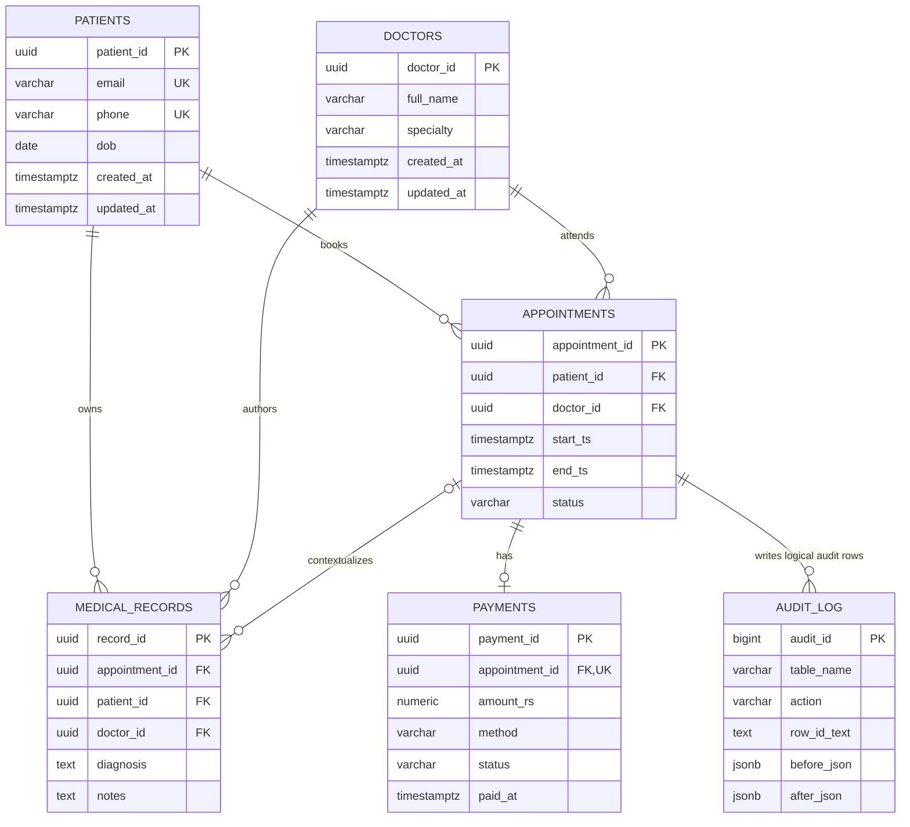

# Telemedicine PostgreSQL Database

[](https://github.com/pm2m1/Telemed_sql/actions/workflows/ci.yml)

## 1. Project overview

This repository contains a PostgreSQL 16 database for a small telemedicine system. It models patients, doctors, appointments, medical records, payments, and appointment audit history. Ordered initialization scripts create the schema, PL/pgSQL workflows, triggers, indexes, analytical views, and development seed data.

The project is designed as a database-focused reference implementation. Docker Compose provides local PostgreSQL and pgAdmin services, while GitHub Actions builds the database from the SQL files and runs assertion-style integration tests.

## 2. Features

- Patient and doctor profiles
- Appointment booking, cancellation, and completion workflows
- Database-enforced protection against overlapping doctor bookings
- One payment record per appointment, with payment processing and refund/failure handling
- Optional appointment-linked medical records
- Automatic appointment audit logging for inserts, updates, and deletes
- Automatic `updated_at` maintenance
- Trigram-assisted patient search
- Analytical views for activity, revenue, utilization, patient history, and specialty performance
- Deterministic PostgreSQL tests that roll back their fixtures

## 3. Technology stack

- PostgreSQL 16
- PL/pgSQL
- PostgreSQL extensions: `uuid-ossp`, `pg_trgm`, and `btree_gist`
- Docker and Docker Compose
- pgAdmin 4 for optional local administration
- GitHub Actions for CI
- Plain SQL/PLpgSQL assertions for tests

## 4. Architecture/database overview

The numbered scripts under `db/init/` are the source of truth and must run in filename order. Tables are created first, followed by relational constraints and indexes, trigger functions, public workflow functions, analytical views, and seed data.

`book_appointment` creates an appointment and its `PENDING` payment in the caller's transaction. Application-friendly overlap validation runs before insertion, while a partial GiST exclusion constraint is the final concurrency-safe guard. Cancellation and completion lock the appointment row before validating its current state; payment processing locks the related payment row.

`audit_log` is intentionally append-oriented. Its `row_id_text` is a logical reference to the affected appointment rather than a foreign key, so audit history can survive appointment deletion.

## 5. ER diagram



The `appointments` to `audit_log` line is a logical relationship implemented by the appointment audit trigger; no foreign key is present. `medical_records.appointment_id` is nullable and is not unique, so an appointment can be associated with multiple records.

## 6. Schema/table explanation

| Table | Purpose | Important integrity rules |
| --- | --- | --- |
| `patients` | Patient identity and contact details | UUID primary key; unique email and phone; required name, date of birth, phone, and email |
| `doctors` | Clinician name and specialty | UUID primary key; required name and specialty |
| `appointments` | Patient/doctor time slots and workflow state | Required patient and doctor foreign keys; valid time order; status limited to `BOOKED`, `CANCELLED`, or `COMPLETED`; no overlapping `BOOKED` ranges for one doctor |
| `medical_records` | Diagnosis and consultation notes | Required patient and doctor foreign keys; optional appointment foreign key uses `ON DELETE SET NULL` |
| `payments` | One payment lifecycle per appointment | Unique required appointment foreign key; non-negative amount; enumerated method and status values |
| `audit_log` | Before/after snapshots for appointment changes | Action limited to `INSERT`, `UPDATE`, or `DELETE`; appointment identifier stored as text |

Foreign keys to patients and doctors use `ON DELETE RESTRICT`. Payments also restrict appointment deletion, while medical records retain their content and clear `appointment_id` if the referenced appointment is deleted.

## 7. Business rules

- Appointment end time must be later than start time.
- New appointments and rescheduled start times cannot be in the past. Status-only updates remain possible after an appointment starts so it can be completed or cancelled.
- Only `BOOKED` appointments participate in overlap protection.
- Doctor time ranges are half-open: `[start_ts, end_ts)`. A 10:00-10:30 appointment and a 10:30-11:00 appointment are adjacent, not overlapping.
- The exclusion constraint checks `doctor_id` equality and time-range overlap. Unlike a `SELECT`-before-`INSERT` check, PostgreSQL coordinates concurrent writes through the constraint, so two transactions cannot both commit conflicting bookings.
- Changing an appointment to `CANCELLED` removes it from the exclusion predicate and releases its slot.
- Patient email and phone are unique.
- Payment amounts must be non-negative. Methods are `CASH`, `UPI`, `CARD`, or `WALLET`; statuses are `PENDING`, `SUCCESS`, `FAILED`, or `REFUNDED`.
- Public workflow functions allow only `BOOKED` appointments to be cancelled or completed and only `PENDING` payments to be processed.
- Cancelling an appointment changes a `SUCCESS` payment to `REFUNDED` and a `PENDING` payment to `FAILED`.

## 8. Stored procedures/functions

| Function | Result | Behavior |
| --- | --- | --- |
| `book_appointment(patient, doctor, start, end, amount, method)` | Appointment UUID | Validates inputs and referenced rows, checks overlap, inserts a `BOOKED` appointment, and inserts its `PENDING` payment |
| `cancel_appointment(appointment)` | Boolean | Locks and cancels a `BOOKED` appointment; updates its payment to `REFUNDED` or `FAILED` when applicable |
| `complete_appointment(appointment)` | Boolean | Locks a `BOOKED` appointment and changes it to `COMPLETED` |
| `process_payment(appointment, status)` | Boolean | Locks a `PENDING` payment and changes it to `SUCCESS` or `FAILED`; successful payments receive `paid_at` |

Errors propagate to the caller with useful messages and SQLSTATEs. The functions do not swallow failures; PostgreSQL rolls back their statement effects when an error escapes.

## 9. Triggers and audit logging

- `trg_no_past_appointments` rejects direct inserts in the past and attempts to reschedule into the past.
- `trg_audit_appointments` writes one audit row after every appointment `INSERT`, `UPDATE`, or `DELETE`.
- `trg_*_updated_at` triggers maintain `updated_at` on patients, doctors, appointments, medical records, and payments.

Appointment audit rows use these payload conventions:

| Action | `before_json` | `after_json` |
| --- | --- | --- |
| `INSERT` | `NULL` | Inserted appointment |
| `UPDATE` | Previous appointment | Updated appointment |
| `DELETE` | Deleted appointment | `NULL` |

## 10. Indexing and search strategy

Primary keys and unique constraints provide their own B-tree indexes. The schema therefore does not add duplicate indexes for patient email, patient phone, or payment appointment ID.

Appointment access paths include doctor/start, patient/start, status, and start-time indexes. A partial index supports booked appointments without embedding the current time:

```sql
CREATE INDEX idx_appointments_booked_doctor_start
ON appointments(doctor_id, start_ts)
WHERE status = 'BOOKED';
```

`start_ts > NOW()` belongs in the runtime query, not in an index predicate, because PostgreSQL index predicates must not depend on a changing clock value. The GiST index backing `excl_appointments_booked_doctor_time` separately enforces the overlap invariant.

Patient full-name and phone trigram indexes support fuzzy lookup with `pg_trgm`. Foreign-key lookup columns, payment status/time fields, and audit table/action/time fields have dedicated indexes for common joins and filters.

## 11. Analytical views and KPIs

| View | Contents |
| --- | --- |
| `vw_daily_appointments_per_doctor` | Daily total, booked, completed, and cancelled counts by doctor |
| `vw_revenue_per_day` | Successful payment count, total, average, and method counts by payment date |
| `vw_doctor_utilization` | Appointment totals, completion/cancellation counts, completion percentage, and booked minutes by doctor |
| `vw_patient_statistics` | Appointment history totals, last appointment, age, and successful amount paid by patient |
| `vw_specialty_performance` | Doctor and appointment counts, completion percentage, and successful revenue by specialty |
| `vw_recent_activity` | Combined appointment and paid-payment activity ordered by time |

These are live views over the transactional tables; they are not materialized snapshots.

## 12. Project structure

```text
.
|-- .github/workflows/ci.yml
|-- db/
|   |-- init/
|   |   |-- 00_extensions.sql
|   |   |-- 01_tables.sql
|   |   |-- 02_constraints_indexes.sql
|   |   |-- 03_triggers.sql
|   |   |-- 04_functions.sql
|   |   |-- 05_views_kpis.sql
|   |   `-- 06_seed.sql
|   `-- tests/
|       |-- 01_schema_tests.sql
|       |-- 02_booking_tests.sql
|       |-- 03_payment_tests.sql
|       |-- 04_trigger_tests.sql
|       |-- 05_view_tests.sql
|       `-- 06_concurrency_constraint_tests.sql
|-- docker-compose.yml
|-- env.example
|-- LICENSE
`-- README.md
```

## 13. Prerequisites

- Docker Desktop or Docker Engine with Docker Compose v2
- Git for cloning the repository
- Optional: PostgreSQL `psql` client for running the same host-side commands as CI

Ports `5432` and `8080` must be available unless you change the Compose mappings.

## 14. Setup instructions

1. Clone and enter the repository.

   ```bash
   git clone https://github.com/pm2m1/Telemed_sql.git
   cd Telemed_sql
   ```

2. Create a local environment file if one does not already exist.

   ```bash
   cp env.example .env
   ```

   In PowerShell, use `Copy-Item env.example .env`.

3. Replace the example development passwords in `.env`, then start the services.

   ```bash
   docker compose up -d --build
   docker compose ps
   ```

4. On a new PostgreSQL volume, the official image runs `db/init/*.sql` in filename order. Inspect startup output if needed.

   ```bash
   docker compose logs postgres
   ```

5. Open a database shell using the database and user configured in Compose.

   ```bash
   docker compose exec postgres \
     sh -c 'psql -U "$POSTGRES_USER" -d "$POSTGRES_DB"'
   ```

pgAdmin is available at `http://localhost:8080`. Use the values configured in `.env` and connect it to host `postgres` on port `5432` from within the Compose network.

## 15. Environment configuration

`env.example` contains local-development placeholders:

| Variable | Purpose |
| --- | --- |
| `POSTGRES_DB` | Initial database name |
| `POSTGRES_USER` | Database superuser for local development |
| `POSTGRES_PASSWORD` | Example local password; replace it |
| `PGADMIN_DEFAULT_EMAIL` | Initial pgAdmin login email |
| `PGADMIN_DEFAULT_PASSWORD` | Example pgAdmin password; replace it |

`.env` is ignored by Git. Do not commit real credentials. The Compose defaults are convenience values for isolated development only and are not production configuration.

## 16. Example SQL usage

### Book an appointment

```sql
SELECT book_appointment(
    '<patient-uuid>'::UUID,
    '<doctor-uuid>'::UUID,
    CURRENT_TIMESTAMP + INTERVAL '7 days',
    CURRENT_TIMESTAMP + INTERVAL '7 days 30 minutes',
    500.00,
    'UPI'
);
```

### Process a payment

```sql
SELECT process_payment('<appointment-uuid>'::UUID, 'SUCCESS');
```

### Cancel an appointment

```sql
SELECT cancel_appointment('<appointment-uuid>'::UUID);
```

### Query upcoming appointments

`$1` below is an application/prepared-statement parameter. The changing time filter is deliberately evaluated at query time.

```sql
SELECT *
FROM appointments
WHERE doctor_id = $1
  AND status = 'BOOKED'
  AND start_ts > NOW()
ORDER BY start_ts;
```

### Query revenue and doctor utilization

```sql
SELECT *
FROM vw_revenue_per_day
ORDER BY payment_date DESC;

SELECT *
FROM vw_doctor_utilization
ORDER BY completion_rate_percent DESC NULLS LAST;
```

## 17. Running tests locally

Recreate the database whenever initialization SQL changes. This deletes the local Compose database and pgAdmin volumes.

```bash
docker compose down -v
docker compose up -d --build
docker compose ps
```

The fresh PostgreSQL container automatically runs every `db/init/*.sql` file. After it is healthy, run each test in deterministic filename order from Bash, Git Bash, or WSL:

```bash
set -euo pipefail
for f in db/tests/*.sql; do
  echo "Running test $f"
  docker compose exec -T postgres \
    sh -c 'psql -v ON_ERROR_STOP=1 -U "$POSTGRES_USER" -d "$POSTGRES_DB"' \
    < "$f"
done
```

Every test uses assertions that raise an exception on failure. Expected database errors are caught inside PL/pgSQL blocks, and each test rolls back its fixtures.

If a host `psql` client is installed, the CI-equivalent test command is:

```bash
export PGPASSWORD='<value-from-.env>'
for f in db/tests/*.sql; do
  psql \
    -v ON_ERROR_STOP=1 \
    postgresql://postgres@localhost:5432/telemed \
    -f "$f"
done
```

Adjust the connection user and database if you changed the example values.

## 18. CI/CD

`.github/workflows/ci.yml` starts PostgreSQL 16 for pushes and pull requests targeting `main` or `master`. It installs the PostgreSQL client, waits for a healthy database, and then runs all initialization and test files in lexicographic filename order.

Every shell block uses `set -euo pipefail`, and every `psql` call uses `-v ON_ERROR_STOP=1`. An unhandled SQL error or failed assertion therefore fails the job immediately. The workflow validates the database only; it does not publish images, deploy, commit, or push changes.

## 19. Design decisions

- UUID primary keys are generated with `uuid_generate_v4()`.
- Timestamps use `TIMESTAMPTZ` to preserve instants across client time zones.
- Appointment overlap is modeled as a half-open `tstzrange` and enforced with a partial GiST exclusion constraint for `BOOKED` rows.
- The pre-insert overlap query remains for an early, readable error, but correctness does not depend on it. The exclusion constraint serializes conflicting concurrent writes at the database layer.
- Cancellation is a status change instead of a delete, preserving operational and audit history while releasing the booked range.
- Payment processing and appointment state functions lock the row they validate to avoid stale transition checks.
- Unique constraints, rather than duplicate standalone indexes, enforce patient email/phone and one payment per appointment.
- Tests use generated UUIDs, isolated fixture rows, controlled relative dates, and transaction rollback.

## 20. Screenshots

No screenshot assets are currently included. Maintainers may add real captures later, for example:

- A pgAdmin ERD or schema browser view showing the six tables
- A successful local test run showing each test file and its success notice
- A GitHub Actions run showing the PostgreSQL initialization and test steps
- Example rows from the KPI views using non-sensitive development data

Store future images in a documented directory such as `docs/screenshots/`, add descriptive alt text, and remove or blur credentials, connection strings, personal data, and machine-specific details before committing them.

## 21. Known limitations

- The tests verify the exclusion invariant directly but do not open two simultaneous database sessions as a concurrency harness.
- The project does not include an application API, authentication, authorization, row-level security, scheduling time-zone policy, or notification delivery.
- Direct table updates by highly privileged callers can bypass the intended public workflow functions, although check, foreign-key, trigger, unique, and exclusion rules still apply.
- Medical-record consistency across its appointment, patient, and doctor identifiers is not cross-validated by a composite constraint.
- Analytical views are live and may need materialization or additional reporting indexes for larger workloads.
- Docker Compose uses development-oriented defaults, exposes database/admin ports, and tracks the moving `pgadmin4:latest` image.
- Seed times are relative to database initialization and are intended only for demonstrations.

## 22. Future improvements

- Add a genuine two-session concurrency test that coordinates transactions and verifies one conflicting commit fails.
- Add role-based privileges and row-level security appropriate to patient, clinician, billing, and support access.
- Define an application-facing API and migration strategy for upgrades to existing databases.
- Add appointment time-zone and clinician-availability policies.
- Validate medical-record patient/doctor values against the linked appointment.
- Pin the pgAdmin image and add automated dependency update checks.
- Evaluate materialized KPI views only after measuring real query patterns and data volume.

## 23. License

This project is licensed under the MIT License. See [LICENSE](LICENSE).
