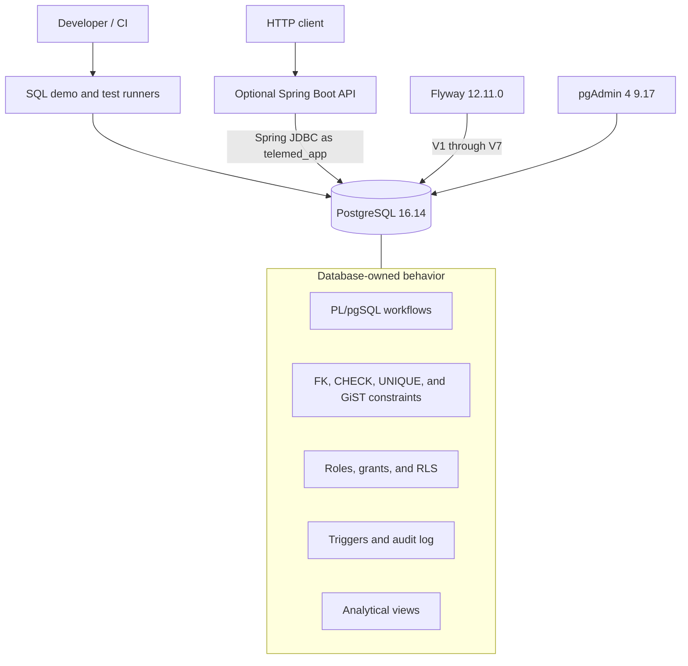
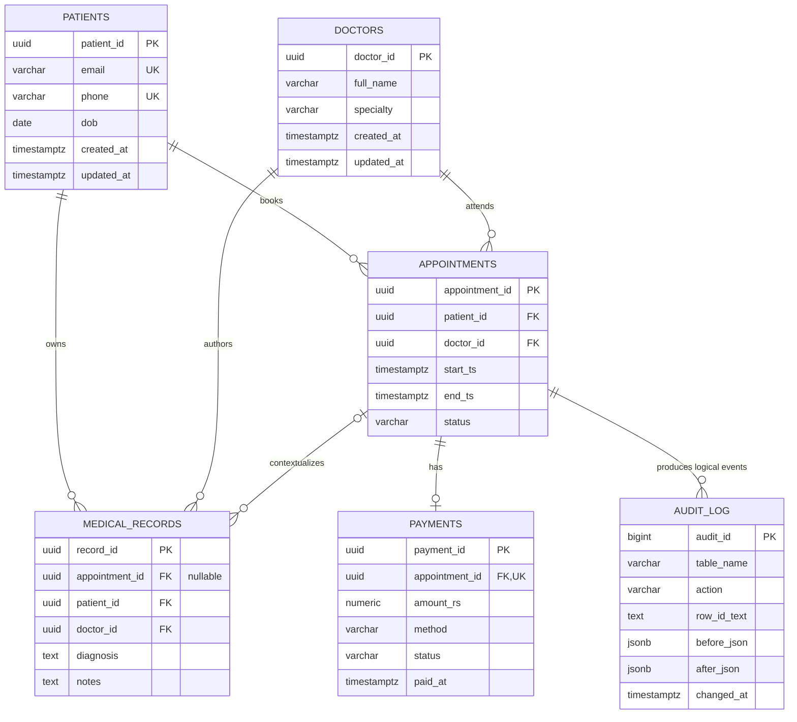
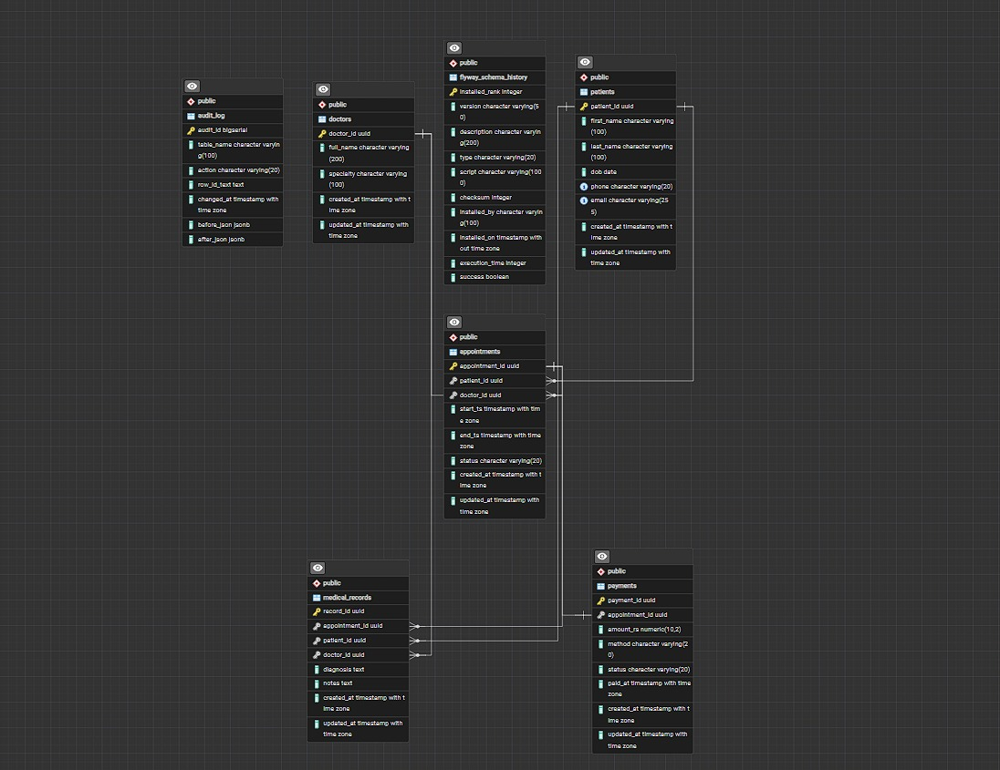
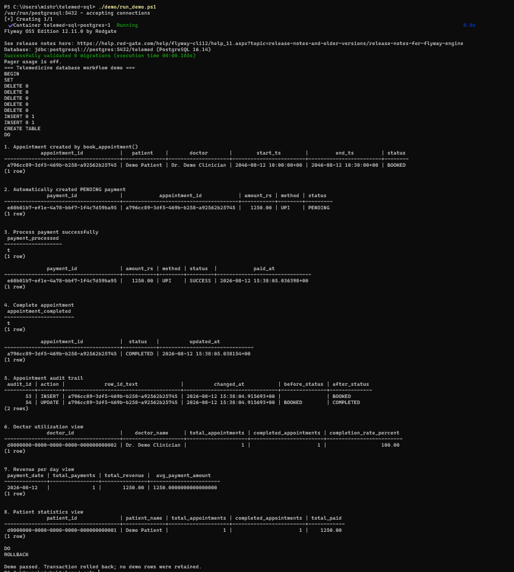
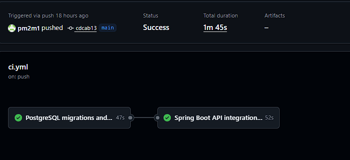

# Telemedicine PostgreSQL Database

[](https://github.com/pm2m1/Telemed_sql/actions/workflows/ci.yml)

A database-first telemedicine backend built around PostgreSQL 16 and PL/pgSQL. The project demonstrates versioned schema evolution, concurrency-safe appointment booking, least-privilege database access, row-level security, audit history, analytical views, reproducible query-plan analysis, and a small Spring Boot API that delegates business workflows to PostgreSQL.

## Highlights

- PostgreSQL 16.14 schema with UUID keys and explicit relational constraints
- PL/pgSQL booking, cancellation, completion, and payment workflows
- GiST exclusion constraint that remains authoritative under concurrent writes
- True two-session race test in addition to single-session invariant tests
- Flyway 12.11.0 migrations, separate development seed data, and a guarded legacy baseline path
- NOLOGIN group roles, least-privilege grants, and doctor-scoped RLS demonstrations
- Appointment audit logging and automatic `updated_at` maintenance
- Six analytical views plus trigram-assisted patient search
- Deterministic rollback-only demo and isolated synthetic benchmark tooling
- Optional Java 21 / Spring Boot 4.1 API using Spring JDBC
- Docker Compose and GitHub Actions coverage for migrations, SQL tests, concurrency, security, and API integration

## Architecture



The HTTP API is an adapter, not a second business-logic engine. It validates request shape, calls stored workflows, reads domain state and analytical views, and maps important PostgreSQL errors to HTTP responses. PostgreSQL constraints remain authoritative.

## Data model



`audit_log.row_id_text` is deliberately a logical reference rather than a foreign key, allowing audit history to survive deletion. `medical_records.appointment_id` remains nullable for standalone records. When it is present, a composite foreign key guarantees that the record's patient and doctor match the referenced appointment.

## Project Preview

### Database Schema

The PostgreSQL data model covers patients, doctors, appointments,
medical records, payments, and appointment audit history.



### End-to-End Demo

The deterministic demo exercises appointment booking, payment processing,
workflow transitions, audit logging, and analytical views using synthetic
data before rolling the transaction back.



### Automated CI

Flyway migrations, PostgreSQL integration tests, security and RLS checks,
multi-session concurrency testing, and Spring Boot integration tests are
validated through GitHub Actions.



## Quick demo

Start the database and apply migrations:

```powershell
docker compose up -d
docker compose run --rm flyway validate
```

```bash
docker compose up -d
docker compose run --rm flyway validate
```

Run the end-to-end demo on PowerShell:

```powershell
./demo/run_demo.ps1
```

Run it on Bash, WSL, or Linux:

```bash
bash ./demo/run_demo.sh
```

The demo creates synthetic patient and doctor fixtures, books an appointment through `book_appointment()`, inspects its pending payment, processes payment, completes the appointment, displays audit events, queries three analytical views, asserts the result, and rolls the transaction back. A successful run leaves no demo rows behind and requires no copied UUIDs.

## Prerequisites

- Docker Desktop or Docker Engine with Docker Compose v2
- Git
- PowerShell 5.1+ on Windows, or Bash on Linux/WSL
- Optional host Java/Maven only when running the API outside Docker

The default ports are PostgreSQL `5432`, pgAdmin `8080`, and API `8081`. All can be changed in `.env`.

## Local setup

1. Clone the repository.

   ```bash
   git clone https://github.com/pm2m1/Telemed_sql.git
   cd Telemed_sql
   ```

2. Create a local environment file.

   ```powershell
   Copy-Item env.example .env
   ```

   ```bash
   cp env.example .env
   ```

3. Replace every `change-me-local-only` value in `.env`. The file is ignored by Git.

4. Start PostgreSQL, migrate the schema, and start pgAdmin.

   ```bash
   docker compose up -d
   docker compose ps -a
   docker compose run --rm flyway info
   ```

5. Optionally load idempotent synthetic development data.

   ```bash
   docker compose --profile seed run --rm seed
   ```

6. Open a database shell.

   ```bash
   docker compose exec postgres sh -c 'psql -U "$POSTGRES_USER" -d "$POSTGRES_DB"'
   ```

pgAdmin is available at `http://localhost:8080`. From pgAdmin, connect to host `postgres`, port `5432`, using the database credentials in `.env`.

Warning: `docker compose down -v` deletes this Compose project's local database and pgAdmin volumes. Use it only when a clean rebuild is intentional.

## Versioned migrations

Flyway is the only authoritative schema-management path. Migrations are immutable after application:

| Version | Responsibility |
| --- | --- |
| `V1` | Extensions and six core tables |
| `V2` | Foreign keys, validation constraints, indexes, and overlap exclusion |
| `V3` | time validation, audit, and `updated_at` triggers |
| `V4` | appointment and payment workflow functions |
| `V5` | six analytical views |
| `V6` | group roles, least-privilege grants, `SECURITY DEFINER` hardening, and RLS |
| `V7` | linked medical-record patient/doctor consistency |

Apply and inspect migrations:

```bash
docker compose up -d postgres
docker compose run --rm flyway migrate
docker compose run --rm flyway validate
docker compose run --rm flyway info
```

Add future changes as the next ordered file, for example `db/migrations/V8__add_notification_outbox.sql`. Never modify an applied migration, because that invalidates its checksum and makes environments disagree.

Development fixtures live in `db/seed/development_seed.sql`; they are not production schema history. This separation keeps migrations deterministic and prevents schema upgrades from silently inserting demo data.

### Upgrading a legacy local volume

Databases created by the repository's former `db/init` scripts correspond to schema version V5 but do not have Flyway history. Back up important data, then run the guarded one-time helper:

```powershell
./db/migrations/baseline_legacy.ps1
```

```bash
bash ./db/migrations/baseline_legacy.sh
```

The helper validates known legacy objects, refuses empty or partially recognized schemas, records a V5 baseline, and applies V6 and later migrations. It does not run `flyway clean` or delete data. See [db/migrations/README.md](db/migrations/README.md).

## Database workflows and concurrency

| Function | Purpose |
| --- | --- |
| `book_appointment(...)` | Validates references and time range, creates a `BOOKED` appointment, and creates one `PENDING` payment |
| `cancel_appointment(uuid)` | Locks and cancels a booked appointment; refunds a successful payment or fails a pending payment |
| `complete_appointment(uuid)` | Locks and completes a booked appointment |
| `process_payment(uuid, status)` | Locks a pending payment and records `SUCCESS` or `FAILED` |

Doctor time ranges use the half-open form `[start_ts, end_ts)`. Therefore `10:00-10:30` and `10:30-11:00` are adjacent, not overlapping.

The booking function performs an early overlap check for a useful error, but the partial GiST exclusion constraint is the authoritative race-safe rule:

```sql
EXCLUDE USING gist (
    doctor_id WITH =,
    tstzrange(start_ts, end_ts, '[)') WITH &&
)
WHERE (status = 'BOOKED')
```

The single-session `06_concurrency_constraint_tests.sql` checks range invariants. The separate harness launches two independent `psql` sessions and validates `SQLSTATE 23P01` from the exclusion constraint:

```powershell
./db/tests/concurrency/run_concurrency_test.ps1
```

```bash
bash ./db/tests/concurrency/run_concurrency_test.sh
```

Session A inserts and holds an uncommitted booking. The runner polls `pg_stat_activity` until that exact hold statement is active, then Session B attempts an overlapping booking. PostgreSQL coordinates the writes; after A commits, B cannot also commit. The verifier also covers different doctors, adjacent ranges, and cancelled slots.

## Database security

Migrations create password-free `NOLOGIN` group roles. Login credentials are provisioned operationally, not stored in schema history.

| Role | Intended access |
| --- | --- |
| `telemed_owner` | Trusted owner for bounded workflow functions; cannot log in directly |
| `telemed_admin` | Broad administrative table access and RLS bypass; cannot log in directly |
| `telemed_app` | Read domain state and execute supported appointment/payment workflows; no direct transactional writes |
| `telemed_doctor` | Read own appointments and records; create/update own clinical record content through RLS |
| `telemed_billing` | Read payments and execute payment processing; no clinical-record access |
| `telemed_analyst` | Read selected aggregate views; no transactional patient data or patient-detail view |

`PUBLIC` table, sequence, and function privileges are revoked. Workflow functions use `SECURITY DEFINER` only where needed, are owned by a dedicated NOLOGIN role, accept typed parameters, have public execution revoked, and use a fixed `search_path`.

Doctor RLS uses `current_setting('app.current_doctor_id', true)`. This demonstrates database enforcement after an application establishes identity. It is not authentication. A production connection pool must set and clear the value transactionally for every checked-out connection and must derive it from a trusted identity provider.

`db/security/provision_login.sql` safely accepts a validated role name, runtime password, and approved membership. The Compose `api` profile uses it to provision the API login. See [db/security/README.md](db/security/README.md).

## Medical-record consistency

A record may remain standalone by storing `appointment_id = NULL`. If it references an appointment, the database enforces this relationship:

```text
(medical_records.appointment_id, patient_id, doctor_id)
    -> (appointments.appointment_id, patient_id, doctor_id)
```

This declarative composite foreign key rejects mismatched patients and doctors without trigger code. On appointment deletion, only `appointment_id` is set to `NULL`; clinical ownership remains intact. V7 first refuses migration if mismatched legacy rows already exist.

## Analytical views

| View | Purpose |
| --- | --- |
| `vw_daily_appointments_per_doctor` | Daily status counts by doctor |
| `vw_revenue_per_day` | Successful payment count, totals, averages, and method counts |
| `vw_doctor_utilization` | Appointment totals, completion ratio, and booked minutes |
| `vw_patient_statistics` | Patient appointment totals, recent activity, age, and successful amount paid |
| `vw_specialty_performance` | Specialty-level doctor, appointment, completion, and revenue aggregates |
| `vw_recent_activity` | Combined appointment and successful-payment activity |

These are live views, not materialized snapshots.

## Optional Spring Boot API

The API requires no frontend and remains optional. Start it with the least-privilege `telemed_app` database login:

```bash
docker compose --profile api up -d --build api
curl http://localhost:8081/actuator/health
```

Endpoints:

| Method | Path | Behavior |
| --- | --- | --- |
| `POST` | `/api/appointments` | Books through `book_appointment()` and returns `201` |
| `GET` | `/api/appointments/{id}` | Returns an appointment and payment |
| `POST` | `/api/appointments/{id}/cancel` | Cancels through the database workflow |
| `POST` | `/api/appointments/{id}/complete` | Completes through the database workflow |
| `POST` | `/api/appointments/{id}/payments` | Processes a pending payment |
| `GET` | `/api/doctors/{id}/appointments` | Lists one doctor's schedule |
| `GET` | `/api/analytics/revenue` | Reads daily revenue aggregates |
| `GET` | `/api/analytics/doctors` | Reads doctor utilization aggregates |
| `GET` | `/api/analytics/patients/{id}` | Reads one patient's analytical summary |

Validation errors return `400`, missing resources return `404`, and overlapping bookings return `409 APPOINTMENT_OVERLAP`. Raw SQL and stack traces are not returned. See [api/README.md](api/README.md) for payloads and tests.

## Reproducible query-plan analysis

The benchmark uses a separate Compose project, dedicated database, deterministic UUIDv5 fixtures, and automatic volume cleanup. Defaults are 1,000 doctors, 20,000 patients, and 100,000 appointments/payments.

```powershell
./benchmarks/run_benchmark.ps1
```

```bash
bash ./benchmarks/run_benchmark.sh
```

For a quick tooling check:

```powershell
./benchmarks/run_benchmark.ps1 -Doctors 25 -Patients 200 -Appointments 1000
```

```bash
BENCHMARK_DOCTORS=25 BENCHMARK_PATIENTS=200 BENCHMARK_APPOINTMENTS=1000 bash ./benchmarks/run_benchmark.sh
```

The output includes `EXPLAIN (ANALYZE, BUFFERS, SETTINGS)` for doctor schedules, patient history, payment aggregation, recent audit history, and fuzzy patient-name search. Patient history is also explained after temporarily dropping its supporting index inside a transaction; `ROLLBACK` restores it. Results are written to ignored `benchmarks/results/latest.txt`.

Plan timings vary with hardware, Docker resources, cache state, PostgreSQL version, and dataset size. This repository does not claim universal speedups or commit local benchmark numbers.

## Testing

The SQL tests are deterministic transaction-scoped assertions:

| File | Coverage |
| --- | --- |
| `01_schema_tests.sql` | tables, constraints, indexes, functions, triggers, and views |
| `02_booking_tests.sql` | valid booking, payment creation, reference/time validation, overlap behavior |
| `03_payment_tests.sql` | success/failure/refund state transitions |
| `04_trigger_tests.sql` | time validation, audit payloads, and timestamps |
| `05_view_tests.sql` | all six analytical views |
| `06_concurrency_constraint_tests.sql` | single-session overlap, adjacency, status, and doctor invariants |
| `07_medical_record_integrity_tests.sql` | linked identity, standalone records, and deletion behavior |
| `08_security_rls_tests.sql` | grants, role boundaries, RLS isolation, and workflow access |
| `09_login_provisioning_tests.sql` | runtime login creation, membership, idempotent rotation, and cleanup |

Run one suite against the Compose database:

```bash
docker compose exec -T postgres sh -c 'psql -v ON_ERROR_STOP=1 -U "$POSTGRES_USER" -d "$POSTGRES_DB" -f /workspace/db/tests/01_schema_tests.sql'
```

Run API integration tests with host Java/Maven:

```bash
mvn -B -ntp -f api/pom.xml verify
```

The API suite uses Testcontainers PostgreSQL 16.14, applies all Flyway migrations from zero, provisions a least-privilege login, and tests booking, conflict mapping, payments, cancellation, completion, invalid input, missing resources, and analytics.

## Continuous integration

GitHub Actions performs these normal checks:

1. validates Compose and shell scripts;
2. starts pinned PostgreSQL through Compose;
3. applies, validates, and reports Flyway migrations;
4. runs the six core SQL suites;
5. runs medical-record integrity separately;
6. runs role/RLS security and runtime login provisioning separately;
7. runs the true two-session concurrency harness;
8. runs the Spring Boot/Testcontainers integration suite on Java 21.

Heavy benchmarks are intentionally excluded from normal CI. CI does not deploy or push artifacts.

## Key engineering decisions

- **Database constraints are authoritative.** Application checks improve errors, while foreign keys, checks, uniqueness, and exclusion constraints protect every writer.
- **Half-open ranges avoid boundary conflicts.** `[start,end)` permits one appointment to begin exactly when another ends.
- **GiST protects concurrent booking.** A pre-insert query alone is race-prone; PostgreSQL coordinates exclusion conflicts across transactions.
- **Flyway replaces volume recreation.** Ordered checksummed migrations support clean creation and controlled upgrades.
- **Seeds are operational data, not schema history.** Development fixtures can change without rewriting migration checksums or appearing in production automatically.
- **RLS complements application authorization.** It narrows database visibility after trusted identity establishment; it does not replace login or HTTP authorization.
- **The demo has no frontend.** A terminal workflow keeps the portfolio focused on database and backend behavior.
- **Benchmarks teach reproduction.** Query plans and measured times are local observations, not marketing claims.
- **PostgreSQL-specific features are intentional.** PL/pgSQL, GiST, `tstzrange`, `pg_trgm`, `btree_gist`, RLS, and `SECURITY DEFINER` are core engineering subjects in this project.

## Project structure

```text
.
|-- .github/workflows/ci.yml
|-- api/                         # Optional Java 21 Spring Boot API
|-- benchmarks/                  # Isolated synthetic plan analysis
|-- db/
|   |-- legacy/                  # Guard for former pre-Flyway schemas
|   |-- migrations/              # Authoritative Flyway V1-V7 history
|   |-- security/                # Runtime login provisioning helper
|   |-- seed/                    # Optional development fixtures
|   `-- tests/
|       `-- concurrency/         # True two-session race harness
|-- demo/                        # Rollback-only end-to-end SQL demo
|-- docs/screenshots/            # Capture guidance; no fabricated images
|-- docker-compose.yml
|-- env.example
`-- README.md
```

## Screenshots

[docs/screenshots/README.md](docs/screenshots/README.md) lists useful real captures to take from a local run: migration output, terminal demo, schema inspection, CI, and analytical query results.

## Known limitations

- The HTTP API has no production identity provider, end-user authentication, or authorization layer.
- `app.current_doctor_id` is a database RLS demonstration; safe connection-pool context management is not implemented in the API.
- There is no notification/email service, frontend, distributed deployment, or production monitoring stack.
- The API is intentionally small and does not expose medical-record authoring or administrative endpoints.
- Login provisioning uses local Compose environment variables; production credentials require a secrets manager.
- Benchmarks are local and synthetic, not production capacity evidence.
- Migration baseline validation recognizes expected legacy objects but cannot prove a manually altered legacy schema is byte-for-byte identical.
- pgAdmin is for local administration and should not be exposed publicly with development settings.

## License

See [LICENSE](LICENSE).
